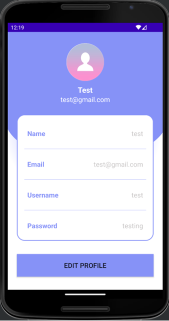

# Virtual Fashion Assistant: Personalized Fashion Advice Powered by AI

## Overview
The **Virtual Fashion Assistant** app is a personalized fashion tool designed to help users find the perfect outfits based on their body type, skin tone, and fashion preferences. Using AI-driven quizzes and curated outfit collections, this app offers personalized fashion recommendations for various occasions, ensuring users can find the best look for any event.

## Key Features
- **Body Type & Skin Tone Quiz**: Users complete a quiz to determine their body type and skin tone, allowing the app to offer tailored fashion advice.
- **Personalized Fashion Style Quiz**: Collects user preferences to suggest fashion items that match their individual style.
- **Occasion-Based Outfit Collections**: Curated outfits for specific occasions (e.g., weddings, office wear, casual outings).
- **User Profile**: Personalized user profile to store preferences, quiz results, and outfit recommendations for a custom experience.

## Screenshots
### 1. Body Type & Skin Tone Quiz

- The quiz helps users determine their body type and skin tone, enabling personalized fashion advice.

### 2. Occasion-Based Outfit Collections

- The app provides curated outfit collections tailored to specific occasions, such as weddings or casual outings.

### 3. User Profile

- The user profile stores preferences and quiz results, ensuring the app provides personalized recommendations every time the user interacts with it.

## Installation & Setup

### Prerequisites
- **Android Studio** (Latest stable version)
- **Java** (>= 8)
- **Gradle** for dependency management
- **Firebase** for authentication and user data storage (optional, if used)

### Steps to Set Up
1. **Clone the Repository**:
   ```bash
   git clone https://github.com/your-username/virtual-fashion-assistant.git
   cd virtual-fashion-assistant
2. Open Project in Android Studio:
- Open Android Studio and choose "Open an Existing Project."
- Navigate to the cloned repository folder and select it.
  
3. Install Dependencies:
- The project uses Gradle for managing dependencies. Open Gradle sync in Android Studio to automatically download required libraries.
- If Firebase is used for user data storage, set up Firebase in your project by following the instructions here.

4. Build the App:
- In Android Studio, click on Build > Make Project to compile the app.
- Connect an Android device or use an emulator, then click Run.

5. Launch the App:
- Once the build is successful, the app will launch on your device or emulator.
- Follow the on-screen instructions to complete the body type, skin tone, and fashion style quizzes to start receiving personalized recommendations.

## How It Works
1. Body Type & Skin Tone Quiz
The app uses a Q&A style quiz to help determine the user’s body type and skin tone. These results are used to personalize the fashion advice provided by the app.

2. Fashion Style Quiz
The app gathers the user’s fashion preferences to offer personalized outfit recommendations based on their style.

3. Occasion-Based Outfit Collections
The app suggests curated outfit collections based on the selected occasion, such as casual, formal, or party wear, helping users find the perfect outfit quickly.

4. Personalized Recommendations
Using the results from the quizzes and the user's style preferences, the app generates tailored outfit suggestions that align with their body type, skin tone, and fashion style.

## Future Work
- Machine Learning Integration: Implement machine learning algorithms to analyze fashion trends and offer more accurate, personalized recommendations.
- Augmented Reality (AR): Future versions of the app will include AR features, enabling users to virtually try on clothes before purchasing, enhancing the user experience.
- Backend Integration: Integrating a robust backend to store user data and manage outfit collections securely.
- Social Network Feature: The app could be expanded to include a social aspect, where users can connect, share outfit ideas, and engage with influencers and brands.

